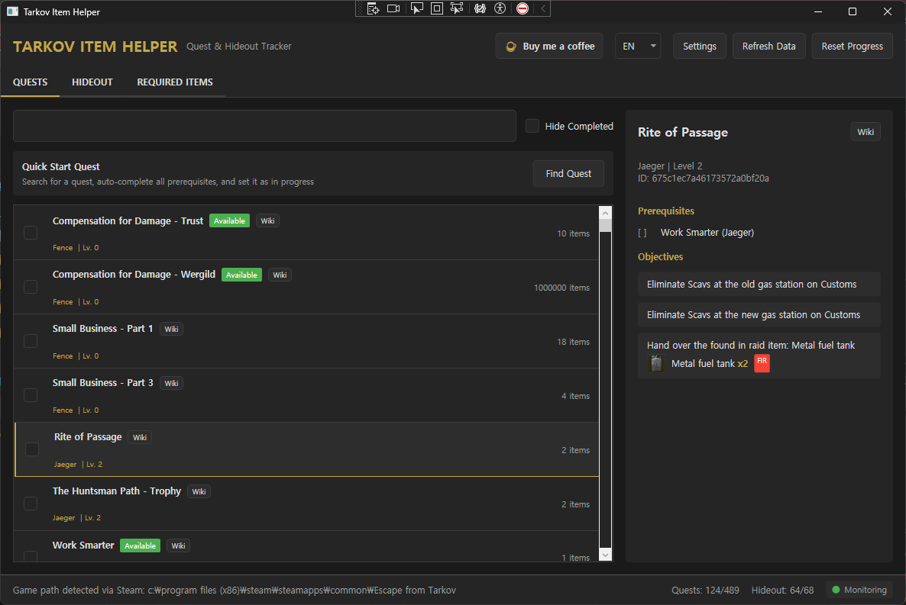
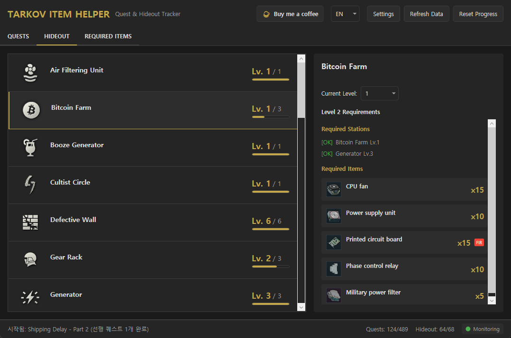
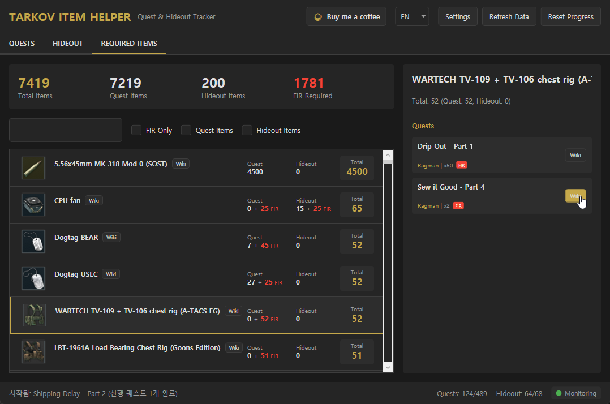

# TarkovHelper

[](README.md)
[](README_KR.md)
[](README_JA.md)

<a href="https://buymeacoffee.com/zeliperstap" target="_blank"></a>

Escape from Tarkovのクエストとハイドアウトの進行状況を追跡するWindowsデスクトップアプリケーションです。

## 主な機能

### クエスト管理
- すべてのクエストの一覧表示と検索
- クエストの完了/進行中ステータスの追跡
- 前提クエストと後続クエストの表示
- クエスト開始時に前提クエストを自動完了
- クエストWikiページへのリンク

### ハイドアウト管理
- 各ハイドアウト施設の建設レベルを追跡
- 各レベルアップグレードに必要なアイテムを表示
- トレーダー、スキル、依存施設の要件を提供

### 必要アイテム追跡
- 進行中のクエストに必要なアイテムを集計
- ハイドアウト建設に必要なアイテムを集計
- 通常アイテムとFIR（Found in Raid）アイテムを別々に追跡
- 所持数量と残り必要数量を計算
- アイテムWikiリンクとアイコンを表示

### ゲームログ監視
- ゲームログからクエスト完了を自動検出
- BSGランチャーとSteam版の両方をサポート
- ゲームインストールフォルダを自動検出

### 多言語サポート
- 日本語 / 韓国語 / 英語対応
- リアルタイム言語切り替え

## スクリーンショット





## インストール方法

### 要件
- Windows OS
- [.NET 8.0 Runtime](https://dotnet.microsoft.com/download/dotnet/8.0)

### リリースダウンロード
[Releases](../../releases)ページから最新バージョンをダウンロードしてください。

### ソースからビルド
```bash
# リポジトリをクローン
git clone https://github.com/Zeliper/Tarkov-Item-Helper.git
cd Tarkov-Item-Helper

# ビルドと実行
dotnet build -c Release
dotnet run -c Release
```

## 使い方

### データ更新
アプリを初めて起動すると、[tarkov.dev](https://tarkov.dev) APIから最新のクエスト、アイテム、ハイドアウトデータを自動的に取得します。

手動でデータを更新するには：
```bash
dotnet run -- --fetch
```

### クエスト追跡
1. **クエスト**タブでクエスト一覧を確認
2. チェックボックスで完了ステータスをマーク
3. 検索バーでクエストを検索
4. クエストをクリックして詳細と前提/後続クエストを確認

### ハイドアウト追跡
1. **ハイドアウト**タブで施設一覧を確認
2. 各施設の現在のレベルを設定
3. 次のレベルアップグレードに必要なアイテムを確認

### 必要アイテム
1. **必要アイテム**タブですべての必要アイテムを確認
2. 所持数量を入力して進捗を追跡
3. FIRアイテムは別途管理

### ゲームログ連携
ゲームインストールフォルダを自動検出し、クエスト完了時に通知を受け取ることができます。

## 技術スタック

- **フレームワーク**: .NET 8.0, WPF
- **言語**: C# 13
- **API**: [tarkov.dev GraphQL API](https://tarkov.dev)

## データ保存場所

すべてのデータは`Data/`フォルダに保存されます：
- `tasks.json` - クエストデータ
- `items.json` - アイテムデータ
- `hideouts.json` - ハイドアウトデータ
- `progress.json` - ユーザー進行状況
- `settings.json` - 言語設定

## ライセンス

MIT License

## クレジット

- ゲームデータ: [tarkov.dev](https://tarkov.dev)
- Escape from TarkovはBattlestate Gamesの商標です。
